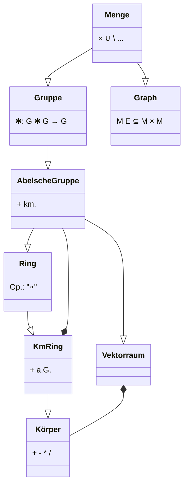

> Bevor wir mit dem Inhalt der eigentlichen Vorlesung anfangen, ist es vielleicht eine gute Idee, sich im Nachhinein nochmal einen Überblick über die Themengebiete **vor** dem [[Module/LA1/5 Vektorräume/5.1 Vektorräume|Vektorraum]] zu verschaffen.

## Algebraische Strukturen

Hier sind einige *Strukturen* als eine Art UML-Diagram (typisch Informatiker 🤓) zusammengefasst:

(*km.*: kommutativ)